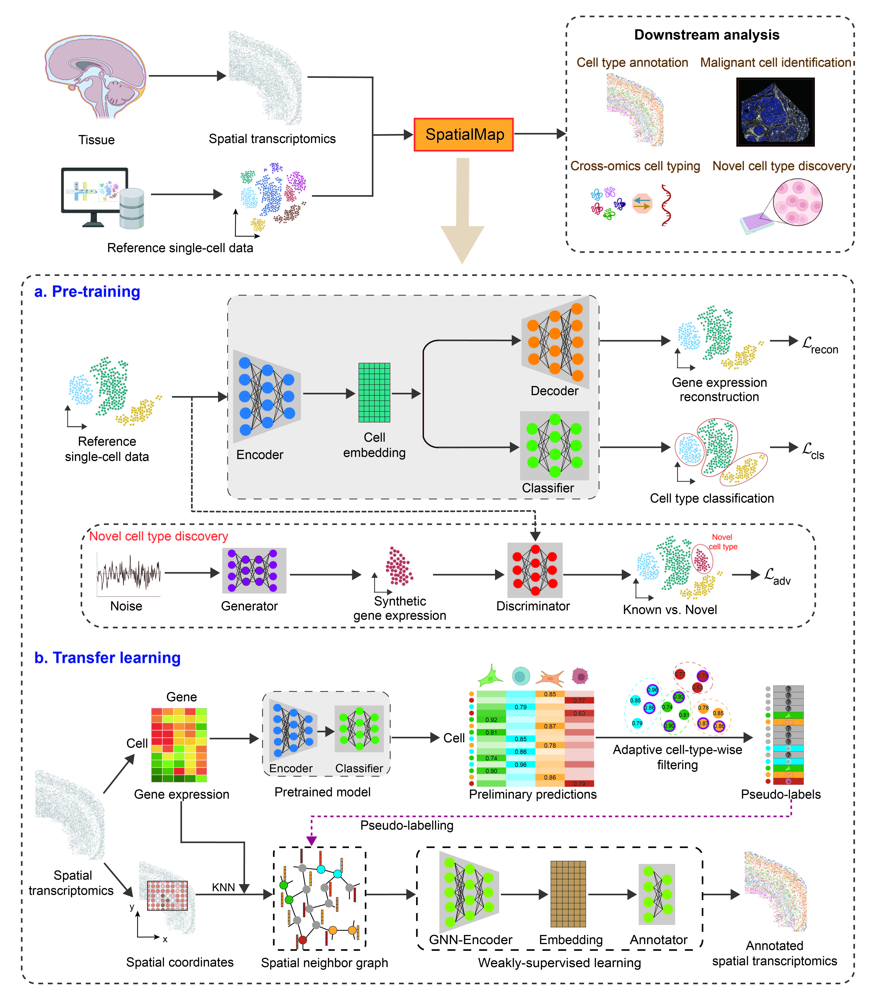

# SpatialMap: An Accurate and Scalable Method for Spatial Cell Typing in Large-Scale Subcellular Spatial Transcriptomics

Here, we present SpatialMap, a deep weakly supervised cell-tying framework that combines graph neural networks (GNN) with transfer learning to annotate the biological identity of cells in subcellular spatial transcriptomics. We demonstrated the superior performance of SpatialMap on both simulated and real-world SRT data over state-of-the-art spatial annotation methods. SpatialMap exhibits strong scalability across various tissue types and technologies, including Stereo-seq, CosMx, MERFISH and Xenium.



---

## Requirements

- python == 3.8.19
- torch == 1.9.1
- torch-geometric == 2.0.3
- scanpy == 1.9.8
- numpy == 1.24.3
- pandas == 2.0.3
- scikit-learn == 1.3.2
- matplotlib == 3.7.5
- seaborn == 0.13.2

For environment management, we recommend **[conda](https://www.anaconda.com/download)**.

---

## Usage

### Spatial transcriptomics cell type annotation

##### Step1 ：Data input and model initialization

```python
model=SpatialMap.SpatialMap(sc_file, srt_file)
```

sc_file: Path of the reference single cell dataset in .h5ad format.

* .X: cell × gene expression matrix
* .obs['label'] : cell type annotations

srt_file: Path of the target spatial transcriptomics dataset in .h5ad format.

* .X: cell × gene expression matrix
* .obs['x' , 'y'] : cell spatial coordinates

##### Step2：Pretrain the model

```python
model.pretrain()
```

##### Step3：Pseudo-label

```python
model.pseudo_label()
```

##### Step4：Annotate

```python
pre=model.annotate()
```

pre: Cell type annotation for target spatial transcriptomics dataset in list format.

##### Example Demo

Before running: Please download the example datasets from 🔗 [Google Drive](https://drive.google.com/drive/folders/1-xVa9ksIzcN-SDD2r-Ij8KO4OiSfYw53?usp=drive_link) and place them under 'Data/' folder.

[Guided Tutorial](./demo_main.ipynb)

##### For new cell type discovery：

```python
model=SpatialMap.SpatialMap(sc_file, srt_file, new=True)
model.pretrain()
model.pretrain_GAN()
model.pseudo_label()
pre=model.annotate()
```

##### For more details about parameters

See [Parameters](./SpatialMap/SpatialMap.py)
